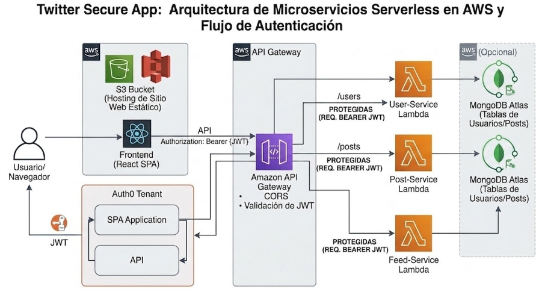

# Twitter Secure Microservices

Refactor of a monolithic backend into a microservices architecture using AWS Lambda and API Gateway. This project maintains the same functionality as the original system while improving scalability, separation of concerns, and deployment flexibility.

**Authors:** 

- David Santiago Castro

- Juan José Mejía

---

## Project Overview

This project represents **Phase 2** of a Twitter-like application. The backend has been decomposed into three independent microservices, each responsible for a specific domain. The frontend remains the same but is adapted to communicate with the API Gateway.

### Key Features

* Public feed and post listing
* Authenticated user profile
* Authenticated post creation (max 140 characters)
* JWT-based authentication
* MongoDB persistence

---

## Architecture



### Backend (Microservices)

Each service is deployed as an AWS Lambda function:

* **user-service-lambda** → `GET /me` (User profile)
* **post-service-lambda** → `GET /posts`, `POST /posts` (Posts management)
* **feed-service-lambda** → `GET /feed` (Optimized feed)

### Frontend

* React + Vite application configured to work with API Gateway

---

## Tech Stack

* **Backend:** Java 11+, Maven, AWS Lambda
* **Frontend:** React 18+, Vite
* **Authentication:** Auth0 (JWT)
* **Database:** MongoDB
* **API Gateway:** AWS API Gateway
* **Testing:** JUnit (backend), Vitest (frontend)

---

## Getting Started

These instructions will help you run the project locally for development and testing.

### Prerequisites

Make sure you have installed:

* Java 11+
* Maven
* Node.js 18+
* MongoDB (local or remote)
* Auth0 account (for production-like testing)

---

## Installation

### 1. Clone the repository

```bash
git clone https://github.com/Juanmejiahz22/AREP-twitter-microservices
cd project-root
```

---

### 2. Configure Environment Variables

#### Backend (Java services)

```bash
export MONGODB_URI="mongodb://localhost:27017"
export MONGODB_DATABASE="twitter_db"
export MONGODB_POSTS_COLLECTION="posts"
export MONGODB_USERS_COLLECTION="users"
export LOCAL_AUTH_BYPASS=true
```

#### Frontend (`frontend-react/.env`)

```bash
VITE_API_MODE=api-gateway
VITE_API_BASE_URL=http://localhost:3001
VITE_API_GATEWAY_BASE_URL=http://localhost:3001
VITE_AUTH0_DOMAIN=your-auth0-domain.auth0.com
VITE_AUTH0_CLIENT_ID=your-client-id
VITE_AUTH0_AUDIENCE=your-api-audience
```

---

### 3. Run Backend Services

Each service runs independently:

```bash
cd post-service-lambda
mvn clean install
mvn spring-boot:run
```

Repeat for:

* `user-service-lambda`
* `feed-service-lambda`

---

### 4. Run Frontend

```bash
cd frontend-react
npm install
npm run dev
```

App will be available at:
 http://localhost:5173

---

### 5. Optional: Simulate API Gateway (AWS SAM)

```bash
cd infrastructure
sam local start-api --env-vars env.json
```

Test endpoints:

* `GET /feed` (public)
* `GET /posts` (public)
* `POST /posts` (protected)
* `GET /me` (protected)

---

## Authentication

### Production Flow

1. User logs in via Auth0
2. Frontend receives JWT
3. JWT sent in `Authorization` header
4. API Gateway validates token
5. Lambda receives user claims

### Local Development

Use bypass mode:

```bash
LOCAL_AUTH_BYPASS=true
```

Send headers manually:

```
x-test-user-sub
x-test-user-name
x-test-user-email
```

---

##  API Endpoints

| Endpoint | Method | Protected | Description      |
| -------- | ------ | --------- | ---------------- |
| `/feed`  | GET    |  No      | Retrieve feed    |
| `/posts` | GET    |  No      | List posts       |
| `/posts` | POST   |  Yes     | Create post      |
| `/me`    | GET    |  Yes     | Get user profile |

---

## Running Tests

### Backend (JUnit)

```bash
mvn test
```

### Frontend (Vitest)

```bash
npm run test
```

### Test Coverage Includes:

* Business logic validation
* API handler behavior
* Authentication & authorization
* Input validation (e.g., post length)

---

## Demonstration video
If the video doesn't play for any reason, please contact us and we'll look into it

https://drive.google.com/file/d/1Wu02W9s8GxpPPUWPcsa2KHg8-AyUsNRE/view?usp=sharing

## Deployment

### Steps to Deploy on AWS

1. Build each service:

   ```bash
   mvn clean package
   ```

2. Deploy JARs to AWS Lambda

3. Configure API Gateway routes

4. Add JWT Authorizer

5. Deploy frontend 

6. Set environment variables in Lambda

---

## Database Setup

Required MongoDB collections:

* `posts`
* `users`

### Run MongoDB locally

```bash
mongod --dbpath ./data
```

Or with Docker:

```bash
docker run -d -p 27017:27017 mongo
```

---

## Project Structure

```
.
├── user-service-lambda/
├── post-service-lambda/
├── feed-service-lambda/
├── frontend-react/
├── test-report/
└── README.md
```

---

## Common Issues

**MongoDB connection refused**

* Ensure MongoDB is running
* Verify `MONGODB_URI`

**Auth not working locally**

* Enable `LOCAL_AUTH_BYPASS`

**Frontend can't reach backend**

* Check `VITE_API_BASE_URL`

**Lambda fails to start**

* Verify Java version (11+)
* Ensure env variables are set

---

## Versioning

This project follows **Semantic Versioning (SemVer)**.

---

## Contributing

At the moment, there is no separate CONTRIBUTING.md file in the repository, but the project can still be improved through forks, pull requests, or team updates in future iterations.

---

## Authors
- Juan José Mejía
- David Santiago Castro

## License

This project is licensed under the MIT License. See `LICENSE.md` for details.

---

## Acknowledgments

* Inspiration from distributed systems design principles
* Thanks to contributors and open-source tools used in this project

---
